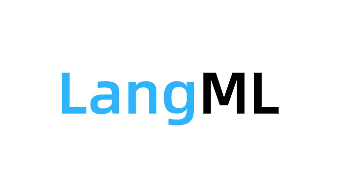

<p align='center'></p>

LangML (**Lang**uage **M**ode**L**) is a Keras-based and TensorFlow-backend language model toolkit, which provides mainstream pre-trained language models, e.g., BERT/RoBERTa/ALBERT, and their downstream application models.


[](https://pypi.org/project/langml/) [](https://code.alipay.com/riskstorm/langml/blob/master/) [](https://code.alipay.com/riskstorm/langml/blob/master/)

# Outline
- [Outline](#outline)
- [Features](#features)
- [Installation](#installation)
- [Quick Start](#quick-start)
  - [Set a Keras variant](#set-a-keras-variant)
  - [Load pretrained language models](#load-pretrained-language-models)
  - [Finetune a model](#finetune-a-model)
  - [Use langml-cli to train baseline models](#use-langml-cli-to-train-baseline-models)
  - [Prompt-Based Tuning](#prompt-based-tuning)
- [Documentation](#documentation)
- [Reference](#reference)


# Features
<a href='#features'></a>

- Common and widely-used Keras layers: CRF, Attentions, Transformer
- Pretrained Language Models: Bert, RoBERTa, ALBERT. Friendly designed interfaces and easy to implement downstream singleton, shared/unshared two-tower or multi-tower models.
- Tokenizers: WPTokenizer (wordpiece), SPTokenizer (sentencepiece)
- Baseline models: Text Classification, Named Entity Recognition, Contrastive Learning. It's no need to write any code, and just need to preprocess the data into a specific format and use the "langml-cli" to train various baseline models.
- Prompt-Based Tuning: PTuning


# Installation
<a href='#installation'></a>

You can install or upgrade langml/langml-cli via the following command:

```bash
pip install -U langml
```

# Quick Start
<a href='#quick-start'></a>

## Set a Keras variant

1) Use pure Keras (default setting)
   
```bash
export TF_KERAS=0
```

2) Use TensorFlow Keras

```bash
export TF_KERAS=1
```


## Load pretrained language models

```python
from langml import WPTokenizer, SPTokenizer
from langml import load_bert, load_albert

# load bert / roberta plm
bert_model, bert = load_bert(config_path, checkpoint_path)
# load albert plm
albert_model, albert = load_albert(config_path, checkpoint_path)
# load wordpiece tokenizer
wp_tokenizer = WPTokenizer(vocab_path, lowercase)
# load sentencepiece tokenizer
sp_tokenizer = SPTokenizer(vocab_path, lowercase)
```

## Finetune a model

```python
from langml import keras, L
from langml import load_bert

config_path = '/path/to/bert_config.json'
ckpt_path = '/path/to/bert_model.ckpt'
vocab_path = '/path/to/vocab.txt'

bert_model, bert_instance = load_bert(config_path, ckpt_path)
# get CLS representation
cls_output = L.Lambda(lambda x: x[:, 0])(bert_model.output)
output = L.Dense(2, activation='softmax',
                 kernel_intializer=bert_instance.initializer)(cls_output)
train_model = keras.Model(bert_model.input, cls_output)
train_model.summary()
train_model.compile(loss='categorical_crossentropy', optimizer=keras.optimizer.Adam(1e-5))
```

## Use langml-cli to train baseline models

1) Text Classification

```bash
$ langml-cli baseline clf --help
```

2) Named Entity Recognition

```bash
$ langml-cli baseline ner --help
```

3) Contrastive Learning

```bash
$ langml-cli baseline contrastive --help
```

4) Text Matching

```bash
$ langml-cli baseline matching --help
```

## Prompt-Based Tuning

Use Ptuning for text classification:

```python
from langml.prompt import Template,  PTuniningPrompt, PTuningForClassification
from langml.tokenizer import WPTokenizer

vocab_path = '/path/to/vocab.txt'

tokenizer = WPTokenizer(vocab_path, lowercase=True)

# 1. Define a template
template = Template(
    #  must specify tokens that are defined in the vocabulary, and the mask token is required
    template=['it', 'was', '[MASK]', '.'],
    # must specify tokens that are defined in the vocabulary.
    label_tokens_map={
        'positive': ['good'],
        'negative': ['bad', 'terrible']
    },
    tokenizer=tokenizer
)

# 2. Define Prompt Model

bert_config_path = '/path/to/bert_config.json'
bert_ckpt_path = '/path/to/bert_model.ckpt'

prompt_model = PTuniningPrompt('bert', bert_config_path, bert_ckpt_path,
                               template, freeze_plm=False, learning_rate=5e-5, encoder='lstm')
prompt_classifier = PTuningForClassification(prompt_model, tokenizer)

# 3. Train and Infer

data = [('I do not like this food', 'negative'),
        ('I hate you', 'negative'),
        ('I like you', 'positive'),
        ('I like this food', 'positive')]

X = [d for d, _ in data]
y = [l for _, l in data]

prompt_classifier.fit(X, y, X, y, batch_size=2, epoch=50, model_path='best_model.weight')
# load pretrained model
# prompt_classifier.load('best_model.weight')
print("pred", prompt_classifier.predict('I hate you'))
```


# Documentation
<a href='#documentation'></a>

Please visit the [langml.readthedocs.io](https://langml.readthedocs.io/en/latest/index.html) to check the latest documentation.


# Reference
<a href='#reference'></a>

The implementation of pretrained language model is inspired by [CyberZHG/keras-bert](https://github.com/CyberZHG/keras-bert#Download-Pretrained-Checkpoints) and [bojone/bert4keras](https://github.com/bojone/bert4keras).
